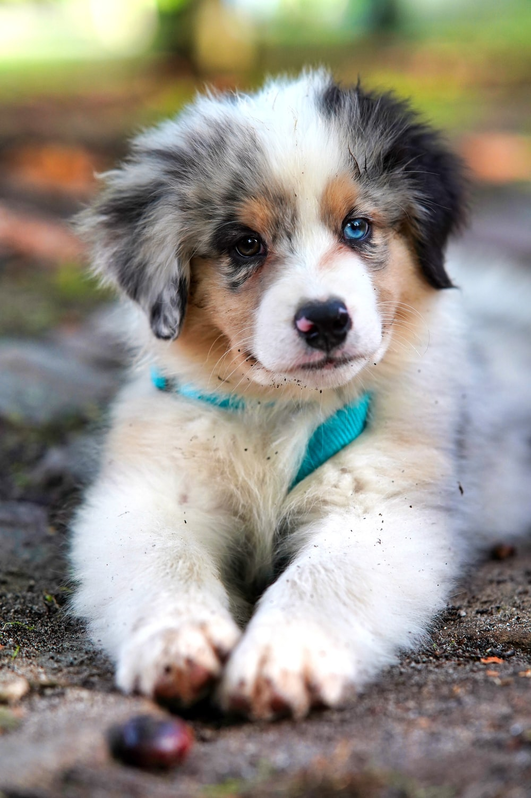

This post is provided as an example of desired parity with the `mdx` post. Ideally it
allows you to create your source in the same way, with a local relative path to a picture,
like this:

The image above is in the same folder, next to this file. The process to accomplish this is
as follows:

1. When the `md` file is sourced, the file path is provided to the hypothetical bundler config. `content/markdown-post/markdown-post.md`
2. The directory is parsed from the file path, and set as the `cwd` for bundler. `content/markdown-post`
3. The path to `puppy.jpg` which needs to be bundled, is now understood to be `content/markdown-post/puppy.jpg`
4. `puppy.jpg` is copied to the Next.js public folder by bundler.
5. Finally, thanks to the bundler the URL in the compiled `markdown-post` body is updated to the bundled, public path, `public/images/markdown-post/puppy.jpg`.
